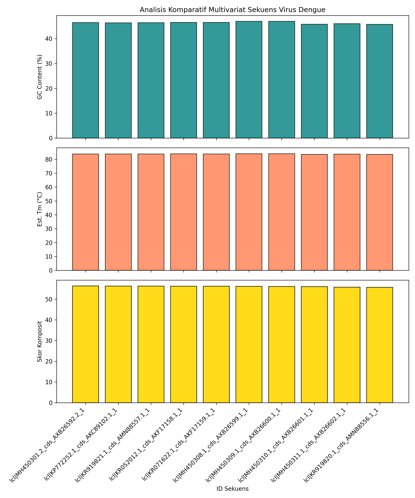

# G0401241007-mini-project-dengue-pipeline
Pipeline analisis bioinformatika multivariat sekuens genom Virus Dengue.
# Pipeline Analisis Multivariat Sekuens Genom Virus Dengue

Repositori ini dibuat untuk memenuhi tugas **Mini Project Analisis Pipeline Bioinformatika** (Batas Pengumpulan: 27 Juni 2026). Program ini memproses sekuens genom Virus Dengue dari format mentah FASTA, melakukan analisis multivariat komposit, dan mengekspor hasilnya secara terstruktur.

---

## Alur Pipeline

Pipeline berjalan secara sekuensial mengikuti diagram alir berikut:

```text
[dengue.fasta] ──> (1. Parsing FASTA) ──> Disimpan dalam LIST (Header, Seq)
                                                    │
                                                    ▼
                                      (2. Perhitungan Frekuensi) ──> DICTIONARY Basa (A,C,G,T)
                                                    │
                                                    ▼
                                      (3. Ekstraksi Metrik Multivariat)
                                        ├── GC Content (%)
                                        ├── Estimasi Melting Temperature / Tm (°C)
                                        └── Rasio O/E Dinukleotida CpG
                                                    │
                                                    ▼
                                      (4. Integrasi Skor Komposit)
                                                    │
                                                    ▼
                                      (5. Pengurutan & Ekspor Data)
                                        ├── Top 3 D Ditampilkan di Terminal
                                        ├── File Tabular 'hasil_analisis_dengue_advanced.csv'
                                        └── Plot Grafik 'grafik_analisis_multivariat.png'
```
## Metodologi Kontekstual & Rumus Analisis

Pendekatan analisis dalam pipeline ini tidak hanya mengukur kuantitas basa tunggal, melainkan mengintegrasikan tiga parameter fungsional virologi:

1. **Penyimpanan Struktur Data (List & Dictionary)**
   Mengurai dokumen FASTA, menyimpan indeks sekuens ke dalam konstruksi data *List*, dan memetakan frekuensi sekuensial nukleotida tunggal ($A, C, G, T$) menggunakan pemetaan kata kunci pada *Dictionary*.

2. **Karakterisasi Termal ($T_m$)**
   Menghitung estimasi *Melting Temperature* global untuk memprediksi stabilitas termodinamika sekunder RNA ketika membentuk untai ganda perantara (*dsRNA intermediate*) saat bereplikasi di sel inang. Menggunakan modifikasi rumus empiris berbasis kandungan garam:

   $$\text{Est. } T_m = 64.9 + 41 \times \frac{(G + C - 16.4)}{A + T + G + C}$$

3. **Penanda Imun (*CpG Depletion Marker*)**
   Mengukur rasio antara frekuensi dinukleotida CpG yang teramati (*Observed*) dengan frekuensi acak teoretis (*Expected*). Virus ssRNA seperti Dengue secara evolusioner menekan jumlah CpG (*CpG depletion*) agar lolos dari degradasi oleh protein imun bawaan inang (*Zinc Finger Antiviral Protein* / ZAP):

   $$\text{Rasio CpG} = \frac{\text{Jumlah 'CG' aktual}}{\frac{\text{Jumlah 'C'} \times \text{Jumlah 'G'}}{\text{Total Panjang Basa}}}$$

4. **Skor Komposit Multivariat**
   Penentuan peringkat akhir tidak berbasis variabel tunggal, melainkan menggunakan indeks komposit tertimbang untuk menghasilkan penilaian yang objektif.
---

## Struktur Repositori
```text
├── dengue.fasta                       # Dataset mentah sekuens nukleotida Virus Dengue
├── main.py                            # Skrip utama pipeline analisis bioinformatika
├── hasil_analisis_dengue_advanced.csv # Output tabular komprehensif seluruh isolat
├── grafik_analisis_multivariat.png    # Visualisasi grafik komparatif multi-panel
└── README.md                          # Dokumentasi teknis proyek
```
## Hasil Analisis Utama (Top 3 Sekuens)
Berdasarkan kriteria skor komposit multivariat, berikut merupakan 3 isolat terbaik dari dataset:
1. **Rank 1:** lcl|MH450301.2_cds_AXB26592.2_1 (Skor: 56.39 | GC: 46.47% | Tm: 83.89°C)
2. **Rank 2:** lcl|KP772252.1_cds_AKC89102.1_1 (Skor: 56.31 | GC: 46.38% | Tm: 83.85°C)
3. **Rank 3:** lcl|KR919821.1_cds_AMN88557.1_1 (Skor: 56.30 | GC: 46.42% | Tm: 83.87°C)

*Catatan: Seluruh hasil tabulasi lengkap untuk seluruh isolat dapat diunduh pada file `hasil_analisis_dengue_advanced.csv`.*

---

## Visualisasi Data
Berikut adalah visualisasi grafik komparatif multi-panel (GC Content, Estimasi Tm, dan Skor Komposit) yang diekspor langsung oleh sistem pipeline:



---

## Cara Menjalankan Program
Kloning repositori ini atau jalankan langsung skrip pada Google Colab dengan menginstal pustaka dependensi terlebih dahulu:
```bash
pip install pandas matplotlib
python main.py


